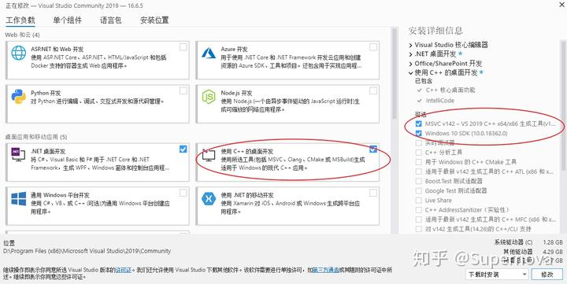

## c++ 运行库问题 (require 14.0 or later )

- 使用conda环境解决

```bash
# 使用 Conda 包管理器安装两个包：`libpython` 和 `m2w64-toolchain`，并且使用 `msys2` 渠道进行安装。
conda install libpython m2w64-toolchain -c msys2

```

- 安装 buildTools 解决 [link](https://link.zhihu.com/?target=https%3A//www.visualstudio.com/downloads/%23build-tools-for-visual-studio-2019)

```
安装Microsoft Build Tools for Visual Studio 2019.；
在 Build Tools 中，安装“使用C++的桌面开发”并确保安装详细信息的前两项勾选。
setuptools Python包的版本必须至少为34.4.0。
```
  

- 安装vc++运行依赖库
http://big.softdl.360tpcdn.com/auto/20230911/104698064_dabfb7c0cb37aadec0c366da6778b09f.exe


> 之前conda base环境出问题了,换成py3.8环境就好了

## ssl问题
> [Advanced Usage - urllib3 2.0.5 ssl issue](https://urllib3.readthedocs.io/en/latest/advanced-usage.html#ssl-warnings)
1. `requests` 库ssl问题
    request.get(varify=False)

2. `urllib3` 库
   urllib3.disable_warnings()
   